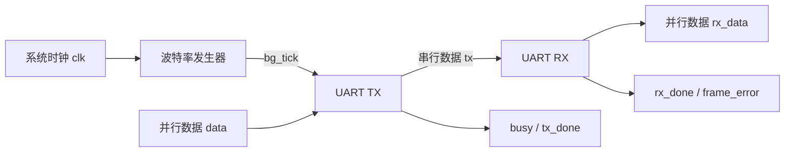
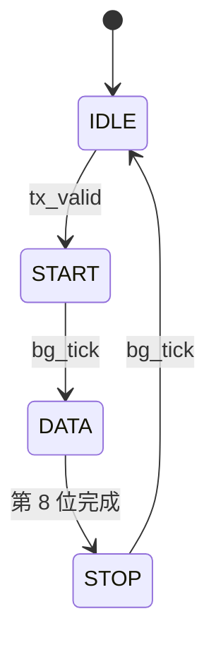
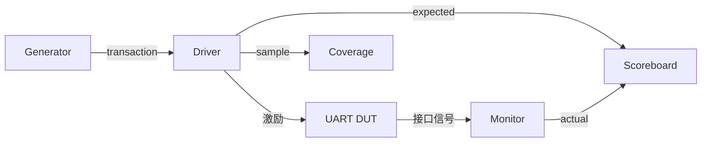
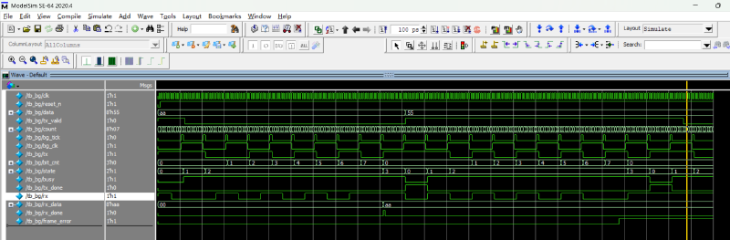

# UART 设计与 SystemVerilog 功能验证

本项目实现了一个可参数化的 UART 发送与接收系统，并围绕其搭建了分层的 SystemVerilog 验证环境。项目从基础 RTL 设计与定向测试起步，逐步扩展到随机激励、异常注入、自动比对、断言检查、功能覆盖率统计及回归验证，用于练习数字 IC 设计与功能验证的完整流程。

> 当前仓库包含 `main`、`version1` 和 `version2` 三个分支。建议切换到 [`version2`](../../tree/version2) 查看完整的 SystemVerilog 验证环境。

## 项目亮点

- 使用 Verilog 完成波特率发生器、UART 发送器和 UART 接收器设计；
- 支持标准 **8N1** 帧格式：1 位起始位、8 位数据、无校验、1 位停止位；
- 数据按照 **LSB First** 顺序发送与接收；
- TX 采用有限状态机完成帧发送，并提供 `busy`、`tx_done` 状态信号；
- RX 在起始位中心进行确认，随后在每个数据位中心采样；
- RX 支持停止位检查，并通过 `frame_error` 上报错误帧；
- 使用 SystemVerilog 类、约束随机、继承、多态、mailbox、virtual interface 搭建分层验证环境；
- 覆盖正常传输、边界数据、传输中复位、Busy 期间重复请求、停止位错误、假起始位及异常恢复等场景；
- 使用 Monitor 和 Scoreboard 自动完成期望值与实际值比对；
- 使用 SVA 检查空闲电平、完成脉冲、复位安全状态及控制信号互斥等协议行为；
- 根据覆盖率盲区补充定向用例，TX 功能覆盖率由 **64.58% 提升至 100%（33/33 bins）**。

## UART 配置

| 配置项 | 当前设置 |
| --- | --- |
| 数据位 | 8 bit |
| 起始位 | 1 bit，低电平 |
| 停止位 | 1 bit，高电平 |
| 校验位 | 无 |
| 数据顺序 | LSB First |
| 空闲电平 | 高电平 |
| 复位方式 | 低有效异步复位 |
| 波特率分频 | `BAUD_DIV = 10`，可参数化 |

波特率与系统时钟的关系为：

```text
baud_rate = f_clk / BAUD_DIV
```

测试平台产生周期为 20 ns 的时钟，即 `f_clk = 50 MHz`。在默认 `BAUD_DIV = 10` 时，仿真波特率为 5 Mbaud。该参数主要用于缩短仿真时间，实际使用时可根据目标时钟和波特率重新配置。

## 系统架构



在环回验证模式下，`tx` 直接连接到 `rx`；在独立 RX 验证模式下，Testbench 通过 `rx_driver` 直接产生串行帧和异常波形。

## RTL 模块

### `baud_generator`

对系统时钟进行计数，每经过 `BAUD_DIV` 个时钟周期产生一个单周期 `bg_tick`，用于控制 TX 每一位数据的发送节拍。

### `uart_tx`

发送器由四状态 FSM 组成：



- `IDLE`：串行输出保持高电平，等待 `tx_valid`；
- `START`：发送低电平起始位；
- `DATA`：通过移位寄存器依次发送 8 位数据；
- `STOP`：发送高电平停止位并产生 `tx_done`；
- `busy` 在非空闲状态保持有效，表示发送器正在工作。

### `uart_rx`

接收器同样采用 `IDLE`、`START`、`DATA`、`STOP` 四个状态：

- 检测到 `rx` 下降为低电平后进入起始位检测；
- 等待半个比特周期，在起始位中心再次确认低电平，过滤假起始；
- 每隔一个完整比特周期在数据位中心采样，共接收 8 位；
- 检查停止位：停止位为高时输出 `rx_done`，为低时输出 `frame_error`；
- 复位或错误帧结束后回到空闲状态，等待下一帧。

## 接口信号

### TX 接口

| 信号 | 方向 | 说明 |
| --- | --- | --- |
| `clk` | 输入 | 系统时钟 |
| `reset_n` | 输入 | 低有效异步复位 |
| `bg_tick` | 输入 | 波特率节拍脉冲 |
| `data[7:0]` | 输入 | 待发送并行数据 |
| `tx_valid` | 输入 | 发送请求 |
| `tx` | 输出 | UART 串行发送数据 |
| `busy` | 输出 | 发送器忙状态 |
| `tx_done` | 输出 | 单帧发送完成脉冲 |

### RX 接口

| 信号 | 方向 | 说明 |
| --- | --- | --- |
| `clk` | 输入 | 系统时钟 |
| `reset_n` | 输入 | 低有效异步复位 |
| `rx` | 输入 | UART 串行接收数据 |
| `rx_data[7:0]` | 输出 | 接收到的并行数据 |
| `rx_done` | 输出 | 正常帧接收完成脉冲 |
| `frame_error` | 输出 | 停止位错误指示 |

## 验证环境

`version2` 使用面向对象的 SystemVerilog 搭建轻量级分层验证平台。它借鉴了 UVM 的组件划分和数据流思想，但没有依赖 UVM 库。



| 组件 | 主要职责 |
| --- | --- |
| Transaction | 描述数据、复位、Busy 干扰、停止位错误和假起始位等事务 |
| Generator | 产生随机激励、边界数据及定向异常场景 |
| Driver | 将事务转换为 DUT 引脚级时序，并在指定阶段注入异常 |
| Monitor | 采样 TX/RX 输出，将串行信号还原为事务 |
| Scoreboard | 比对期望数据和实际数据，统计通过与失败数量 |
| Coverage | 采样场景、数据类型、注入阶段及数据位位置 |
| Assertions | 持续检查关键控制信号和复位行为 |
| Environment/Test | 连接各组件，组织测试阶段并生成最终报告 |

组件之间通过带类型的 `mailbox` 传递事务，通过 `virtual interface` 访问 DUT 信号，事务子类通过继承和虚函数 `copy()` 保留派生类型的信息。

## 验证场景

| 场景 | 验证目标 |
| --- | --- |
| 随机数据传输 | 检查不同数据下 TX/RX 的基本功能 |
| 边界数据 | 定向覆盖 `00`、`FF`、`55`、`AA` 等典型数据模式 |
| 连续帧传输 | 检查相邻帧之间的数据完整性和状态恢复 |
| TX 传输中复位 | 在 START、DATA、STOP 阶段复位，确认中断帧被丢弃且模块安全恢复 |
| Busy 期间重复请求 | 在 START、DATA 的 bit 0～7、STOP 阶段再次拉高 `tx_valid`，确认当前帧不被干扰 |
| RX 停止位错误 | 注入低电平停止位，确认 `frame_error` 正确产生且错误帧不触发正常完成 |
| RX 假起始位 | 注入持续 1～4 个时钟周期的低脉冲，确认接收器不会误收帧 |
| 异常后恢复 | 错误或复位后继续发送正常帧，检查 FSM 不死锁且后续数据可正确接收 |

默认 TX 组合测试依次执行：

- 20 组正常传输；
- 30 组传输中复位及恢复；
- 30 组 Busy 期间重复请求。

## SystemVerilog Assertions

`tb/uart_assertions.sv` 中包含以下关键检查：

- TX 空闲时串行线必须保持高电平；
- `tx_done` 必须是单周期脉冲；
- `rx_done` 与 `frame_error` 不允许同时有效；
- 发送完成前 `busy` 不得提前撤销；
- `tx_done` 只能出现在发送忙状态之后；
- 复位期间 TX 必须保持安全空闲状态；
- 复位期间及复位释放后，RX 结果信号必须保持清零；
- 复位释放后 TX 必须恢复到空闲状态。

## 功能覆盖率

TX Covergroup 主要统计：

- 测试场景：Normal、Reset、Busy；
- 数据类型：`00`、`FF`、`55`、`AA` 和其他随机值；
- 复位注入位置：START、DATA、STOP；
- Busy 请求注入位置：START、DATA、STOP；
- DATA 阶段的 Busy 注入位：bit 0～7；
- 场景与数据类型的交叉覆盖。

通过分析未命中的覆盖点，补充边界数据与各阶段、各数据位的定向用例，最终 TX 功能覆盖率达到：

```text
TX coverage: 100.00%（33/33 bins）
```

## 目录结构

完整的 `version2` 分支结构如下：

```text
UART1/
├── RTL/
│   ├── baud_generator.v
│   ├── uart_tx.v
│   └── uart_rx.v
├── tb/
│   ├── common/
│   │   └── uart_params_pkg.sv
│   ├── transaction/
│   ├── uart_loopback_test/
│   ├── uart_tx_test/
│   ├── uart_rx_test/
│   ├── uart_assertions.sv
│   ├── uart_if.sv
│   ├── uart_pkg.sv
│   └── tb_uart_top.sv
├── smoke_tb/
│   └── tb_uart_smoke.sv
├── sim/
│   ├── compile.do
│   ├── run.do
│   └── wave.do
├── docs/
│   └── wave_rx.png
└── README.md
```

## 分支说明

| 分支 | 内容 |
| --- | --- |
| `main` | 整理后的基础 UART RTL、简单 Testbench 和 ModelSim 脚本 |
| `version1` | UART RTL 功能设计与基础定向仿真 |
| `version2` | 分层 SystemVerilog 验证环境、异常场景、SVA 与功能覆盖率 |

后续可在 `version3` 中进一步完成 UVM 化，包括 Sequence、Driver、Monitor、Agent、Scoreboard、Coverage Collector 及统一回归配置。

## 仿真环境

- ModelSim SE-64 2020.4
- SystemVerilog
- Verilog HDL
- Windows 或 Linux 下的 ModelSim/QuestaSim 命令行环境

## 运行方法

### 1. 克隆仓库

```bash
git clone https://github.com/yxchen333/UART1.git
cd UART1
```

### 2. 选择版本

运行基础 RTL 版本：

```bash
git checkout version1
```

运行完整 SystemVerilog 验证版本：

```bash
git checkout version2
```

### 3. 在 ModelSim 中运行

启动 ModelSim，进入 `sim` 目录后执行：

```tcl
cd sim
do run.do
```

`run.do` 将自动完成：

1. 清理并创建 `work` 库；
2. 按依赖顺序编译参数包、RTL、interface、assertions、package 和顶层 Testbench；
3. 对顶层 `tb_uart_top` 执行优化；
4. 加载波形配置；
5. 运行测试直至 `$finish`。

默认 `version2` 顶层运行 TX 组合测试。测试结束后，Transcript 中应出现类似结果：

```text
PASS: 80
FAIL: 0
TX coverage: 100.00%
UART COMBINE TEST ALL PASSED
```

> 不同提交中的报告字段可能略有变化，请以当前分支的仿真输出为准。
## 细节描述
做了时钟频率检测，tx、rx波特率不要求完全一致，但误差不能太大
TX baud = 115200

低侧：
约 -5.39% PASS
约 -5.65% FAIL

高侧：
约 +5.54% PASS
约 +5.86% FAIL

## 波形示例



## 项目成果

本项目形成了“**验证目标分析 → 激励生成 → DUT 驱动 → 输出监测 → 自动比对 → 覆盖率分析 → 定向补充 → 回归验证**”的完整闭环。验证重点不仅包括正常数据传输，还包括复位、忙状态、错误帧和假起始位等异常条件下的处理与恢复，可用于展示数字 IC 功能验证、仿真 Debug 和覆盖率收敛能力。

## 后续计划

- 将现有类验证环境迁移到标准 UVM 架构；
- 增加 parity、可配置数据位和多停止位支持；
- 增加不同 `BAUD_DIV` 配置下的参数化回归；
- 补充 RX 和端到端场景的功能覆盖率；
- 增加更完整的协议断言与代码覆盖率分析；
- 整理自动化回归脚本和测试结果归档。
